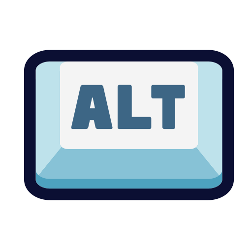

# brief_co2web 

## Instructions pour lancer le projet en local  :

1.  ### Ouvrir le terminal:

   


2.  ### Se déplacer dans le dossier souhaité avec la commande cd:
```bash
cd /Documents/Dossiersouhaité
```
3. ### Cloner le repo distant (github) en local:
```bash
git clone https://github.com/Damien-Trouart/brief_co2web.git
```
4. ### Se déplacer dans le nouveau dossier cloné:
```bash
cd brief_co2web
```

5. ### Ouvrir le site dans un navigateur:
```
* Double cliquer sur index.html 

ou

* Clique droit sur index.html, ouvrir avec et choisir le navigateur souhaité.
```


___
## Sources        :

* [Maquette visuelle du site version **desktop** sur Figma](https://www.figma.com/proto/FqLShNuELRhRpJKklSh6tz/CO2WEB-2.0?page-id=1%3A2221&type=design&node-id=1-2248&viewport=2123%2C410%2C0.36&scaling=scale-down&starting-point-node-id=1%3A2248)

* [Maquette visuelle du site version **mobile** sur Figma](https://www.figma.com/proto/FqLShNuELRhRpJKklSh6tz/CO2WEB-2.0?page-id=0%3A1&type=design&node-id=1-65&viewport=-1213%2C376%2C0.5&scaling=scale-down&starting-point-node-id=1%3A65)

* [Liste d'assets graphique et système de design sur Figma](https://www.figma.com/proto/FqLShNuELRhRpJKklSh6tz/CO2WEB-2.0?page-id=1%3A2795&type=design&node-id=1-2796&viewport=1042%2C-165%2C0.17&scaling=scale-down&starting-point-node-id=1%3A2796)

* Dossier ressources images stockées en local dans le dossier brief_co2web/img


___

## Auteurs  :
* [github.com/Damien-Trouart](https://github.com/Damien-Trouart)
* [github.com/Hiromi-k57](https://github.com/Hiromi-k57)
* [github.com/John-Do59](https://github.com/John-Do59)
* [github.com/MaryamD96](https://github.com/MaryamD96)
